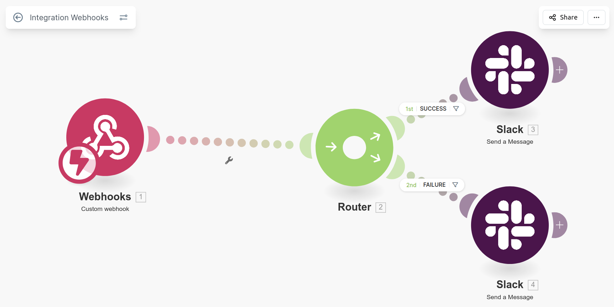
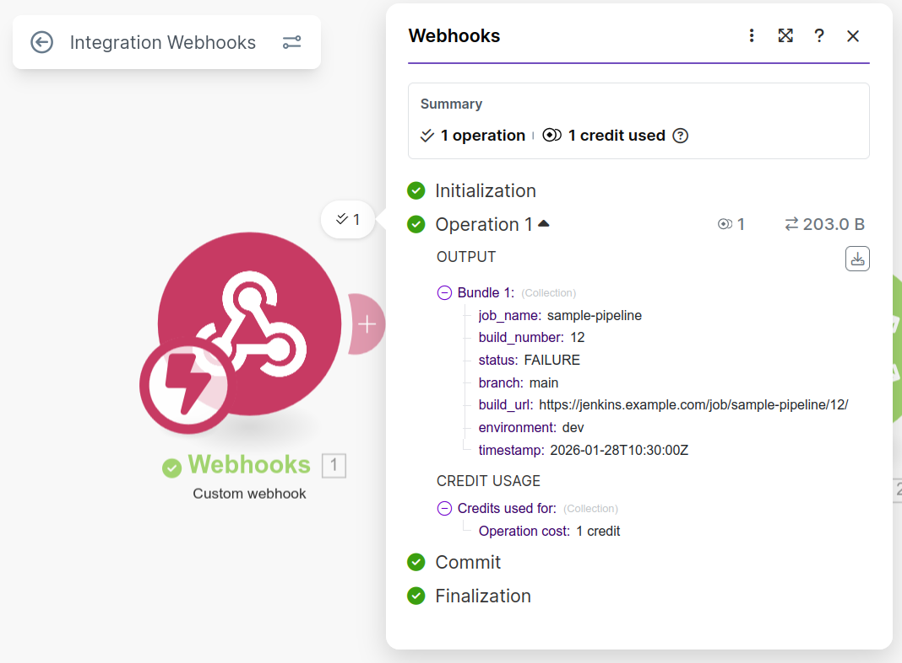
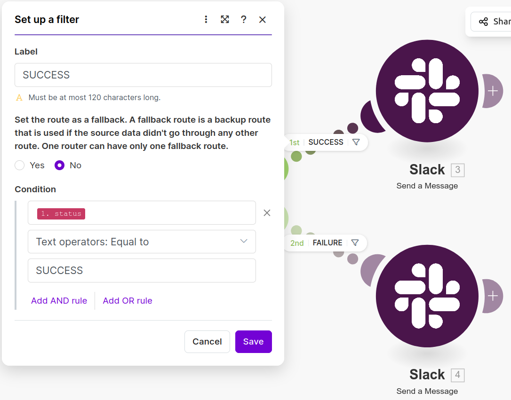
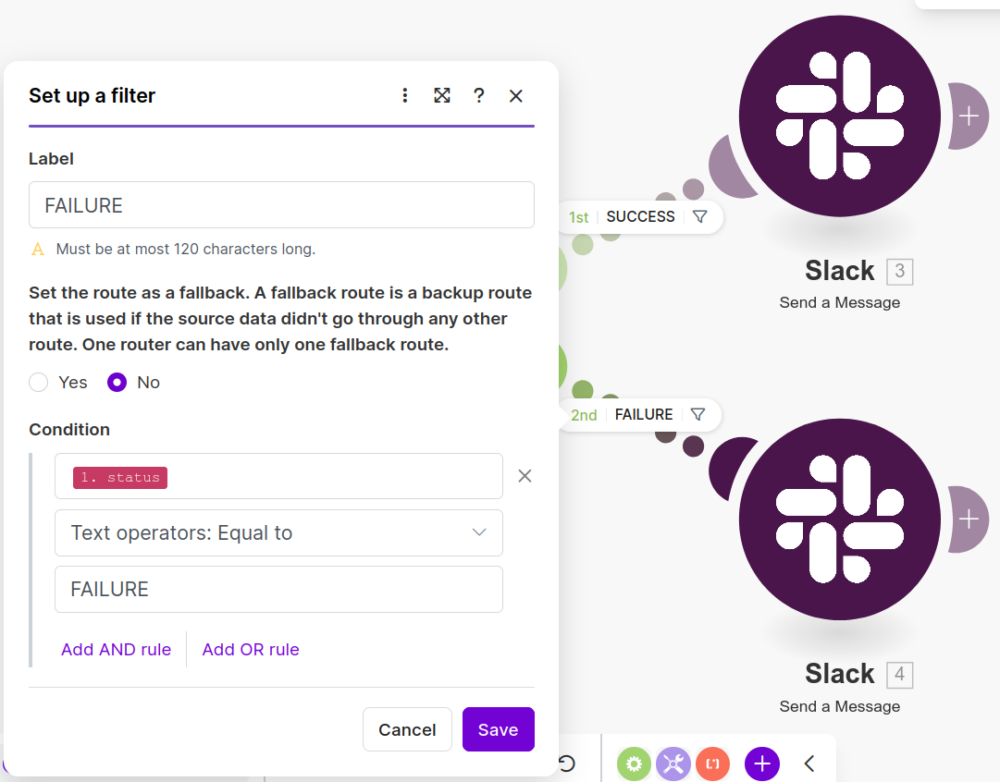
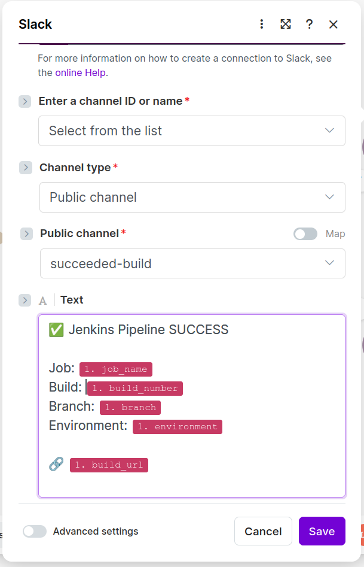
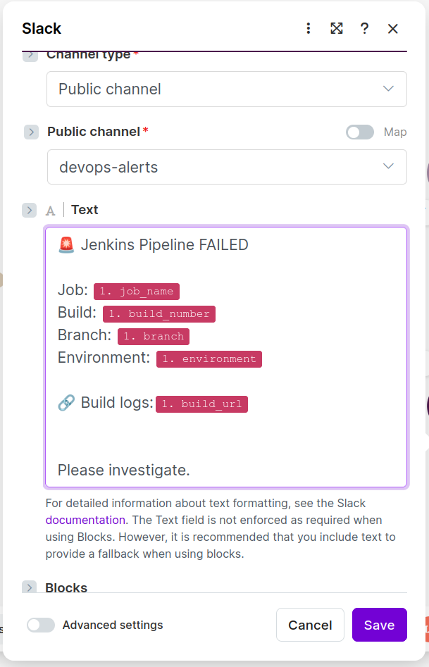

👉  Project: " Integrate Jenkins → Make (Integromat) → Slack + Email "

👉  Goal: Every Jenkins pipeline run automatically notifies developers on SUCCESS or FAILURE.

High-level architecture
```
Jenkins Pipeline
   │
   │  (HTTP POST with build status + metadata)
   ▼
Make Webhook
   │
   ├── Slack module → send message to channel
   └── Email module → send email to developer
```



Why Make?
   - No credentials stored in Jenkins for Slack/Email
   - Easy branching logic (success vs failure)
   - Central notification logic (reusable across pipelines)
   - Great answer for “decoupling CI from integrations” 

Project Structure:
```
.
├── ci/
│   ├── notify.sh
│   └── payload.json
│
├── Jenkinsfile
├── README.md
└── .gitignore
``` 

👉 Create the Make Scenario (Webhook trigger):

- In Make:
   - Create a new scenario
   - Add Webhooks → Custom webhook
   - Click Add, name it: jenkins_pipeline_notifications
   - Copy the generated Webhook URL (we’ll use it in Jenkins)

👉 Capture the payload structure (IMPORTANT):

- Run once (listen for data):
   - Click Run once in the bottom-left
   - Make is now waiting for a request

- Send test payload:
   - From your terminal:
```
curl -X POST "<MAKE_WEBHOOK_URL>" \
  -H "Content-Type: application/json" \
  -d @ci/payload-example.json
```

- Verify:

 

✅ This locks the data contract

👉 Define payload contract (VERY important):
- Jenkins will send structured JSON.
   - See ci/payload.json

👉 Jenkins Pipeline – core integration:

- Store Make webhook URL as Jenkins credential
- Type: Secret Text
- ID: make-webhook-url

👉 Make Scenario – routing logic:
- Step 1: Add Router
- Step 2: Create two routes: SUCCESS and FAILURE
- Step 3: Set up filters for the routes:
   - SUCCESS route: status  |  equal to  |  SUCCESS

   

   - FAILURE route: status  |  equal to  |  FAILURE

   

👉 Configure SUCCESS route:

- Add Slack:
   - Click ➕ on the SUCCESS route
   - Select Slack → Create a message
- Slack message (SUCCESS)



- Add Email
   - Click ➕ after Slack
   - Choose Email → Send an email
   - Example:
      - To: developer email (static for now)
      - Subject: ✅ Jenkins SUCCESS – {{job_name}} #{{build_number}}
   - Body: similar to Slack, slightly more verbose

👉 Configure FAILURE route:

- Add Slack:
   - Click ➕ on the FAILURE route
   - Select Slack → Create a message
- Slack message (FAILURE)



- Email module (FAILURE)
   - Subject: ❌ Jenkins FAILURE – {{job_name}} #{{build_number}}
   - Body:
   - The Jenkins pipeline has FAILED.
      - Job: {{job_name}}
      - Build: #{{build_number}}
      - Branch: {{branch}}
      - Environment: {{environment}}
      - Logs: {{build_url}}

👉 Validate without Jenkins:
- Send both payloads manually:
```
# SUCCESS
jq '.status="SUCCESS"' ci/payload-example.json | \
curl -X POST "<MAKE_WEBHOOK_URL>" \
-H "Content-Type: application/json" \
-d @-

# FAILURE
jq '.status="FAILURE"' ci/payload-example.json | \
curl -X POST "<MAKE_WEBHOOK_URL>" \
-H "Content-Type: application/json" \
-d @-
```

👉 Why this design is GOOD DevOps:

- Jenkins does not talk directly to Slack or Email
- Jenkins only emits events
- Make handles:
   - Notification formatting
   -  Routing
   - Multiple integrations
- Easy to add:
   - MS Teams
   - PagerDuty
   - Jira ticket creation
   - Zero pipeline changes needed